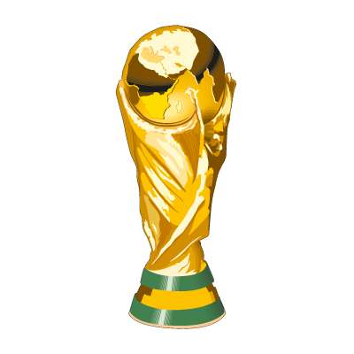

# Plan de corrections — WC 2026 site
> Autoporté — exécutable phase par phase dans des chats séparés.
> Projet : `/home/pargass/projects/pronostics_wc2026/`
> Site : `https://romainfjgaspard.github.io/pronostics_wc2026/`
> Stack : HTML/CSS/JS vanilla (SPA hash-routing) + Python data scripts

---

## Contexte technique rapide

**Fichiers principaux :**
- `index.html` (76 lignes) — structure HTML, nav, footer
- `app.js` (~1 488 lignes) — tout le JS : i18n (`I18N`), routing, vues
- `style.css` (~920 lignes) — tout le CSS

**Structure app.js :**
- `I18N` (lignes 8–143) : toutes les clés FR/EN
- `TEAM_FR_NAMES` (lignes 177–229) : traductions noms d'équipes EN→FR
- `renderFixtures()` (~479) · `renderTeam()` (~556) · `renderTeams()` (~703)
- `renderCompare()` (~882) · `renderRankings()` (~1076) · `renderFifaRankings()` (~1206)
- `renderData()` (~1343) · `sharesite()` (~1466) · `slugify()` (~1482)

**Données clés :**
- `data/rankings.json` — liste de 48 objets `{name, slug, iso2, elo, group}`
- `data/fifa_ranking.json` — `{rankings: [{rank, name, iso2, points, confederation, ...}]}`
- `data/fifa_ranking_history.json` — `{snapshots: [{year, date, rankings: [{rank,name,points,iso2,confederation}]}]}` — 35 snapshots de 1992 à 2026
- `data/flags/` — PNG 160×107 px (w160 depuis flagcdn.com)

---

## PHASE 1 — Bandeau navigation

**Fichiers : `index.html`, `app.js`, `style.css`**

### 1.1 — Supprimer le texte "WC 2026" du brand, garder uniquement le trophée (PC + mobile)

Dans `index.html` ligne 26, remplacer :
```html
<a href="#/" class="brand">⚽ WC 2026</a>
```
Par :
```html
<a href="#/" class="brand" title="WC 2026">
  
</a>
```

Dans `style.css`, remplacer le bloc `.brand` existant par :
```css
.brand {
  display: flex; align-items: center; flex-shrink: 0;
}
.brand-trophy {
  height: 36px; width: auto; display: block;
  filter: drop-shadow(0 0 4px rgba(34,197,94,.4));
}
```

### 1.2 — Titre bilingue "CdM 2026" / "WC 2026" dans le `<title>` et les meta

Dans `app.js`, dans la fonction `setLang()` (ligne ~152), après le `route()`, ajouter :
```js
document.title = LANG === 'fr'
  ? 'CdM 2026 — Données & Statistiques'
  : 'WC 2026 — Data & Statistics';
```

### 1.3 — Icône partage : remplacer 🔗 par une icône SVG "share" (3 cercles reliés)

Dans `index.html`, remplacer :
```html
<button class="share-btn" id="share-btn" onclick="sharesite()">🔗</button>
```
Par :
```html
<button class="share-btn" id="share-btn" onclick="sharesite()" title="Partager / Share">
  <svg width="18" height="18" viewBox="0 0 24 24" fill="none" stroke="currentColor" stroke-width="2.2" stroke-linecap="round" stroke-linejoin="round">
    <circle cx="18" cy="5" r="3"/><circle cx="6" cy="12" r="3"/><circle cx="18" cy="19" r="3"/>
    <line x1="8.59" y1="13.51" x2="15.42" y2="17.49"/>
    <line x1="15.41" y1="6.51" x2="8.59" y2="10.49"/>
  </svg>
</button>
```

### 1.4 — Repositionner le bouton partage pour qu'il soit toujours visible (avant le toggle langue)

**Problème :** `.share-btn` est actuellement dans `.nav-links` qui est masqué sur mobile. Il doit toujours être visible, à gauche du toggle FR/EN.

Dans `index.html`, déplacer le `<button class="share-btn">` **hors** de `.nav-links`, juste **avant** `.lang-toggle` :

```html
<nav id="nav">
  <a href="#/" class="brand" title="WC 2026">
    
  </a>
  <div class="nav-links">
    <a href="#/"             class="nav-link" data-page="fixtures"     data-i18n="nav_fixtures">Matchs</a>
    <a href="#/teams"        class="nav-link" data-page="teams"        data-i18n="nav_teams">Équipes</a>
    <a href="#/fifa-ranking" class="nav-link" data-page="fifa-ranking" data-i18n="nav_fifa">Classement FIFA</a>
    <a href="#/rankings"     class="nav-link" data-page="rankings"     data-i18n="nav_elo">Classement Elo</a>
    <a href="#/data"         class="nav-link" data-page="data"         data-i18n="nav_data">Données</a>
  </div>
  <select class="nav-select" id="nav-select"></select>
  <button class="share-btn" id="share-btn" onclick="sharesite()" title="Partager / Share">
    <svg width="18" height="18" viewBox="0 0 24 24" fill="none" stroke="currentColor" stroke-width="2.2" stroke-linecap="round" stroke-linejoin="round">
      <circle cx="18" cy="5" r="3"/><circle cx="6" cy="12" r="3"/><circle cx="18" cy="19" r="3"/>
      <line x1="8.59" y1="13.51" x2="15.42" y2="17.49"/>
      <line x1="15.41" y1="6.51" x2="8.59" y2="10.49"/>
    </svg>
  </button>
  <div class="lang-toggle">
    <button class="lang-btn" data-lang="fr">FR</button>
    <button class="lang-btn" data-lang="en">EN</button>
  </div>
</nav>
```

Dans `style.css`, mettre à jour le bloc `.share-btn` :
```css
.share-btn {
  background: none; border: none;
  color: var(--muted); cursor: pointer;
  padding: 6px 8px; border-radius: 6px;
  display: flex; align-items: center; justify-content: center;
  flex-shrink: 0;
  transition: color .15s;
}
.share-btn:hover { color: var(--text); }
```

### 1.5 — Corriger le menu mobile (dropdown au lieu des onglets côte à côte)

**Problème :** La breakpoint actuelle est 640px. Sur certains mobiles ou tablettes, les nav-links dépassent. Augmenter la breakpoint à 768px pour plus de sécurité.

Dans `style.css`, remplacer :
```css
@media (max-width: 640px) {
  .nav-links { display: none; }
  .nav-select { display: block; }
}
```
Par :
```css
@media (max-width: 768px) {
  .nav-links { display: none; }
  .nav-select { display: block; }
}
```

Et ajuster aussi le block suivant :
```css
@media (max-width: 700px) {
  .nav-link { padding: 5px 8px; font-size: .78rem; }
  .lang-btn { padding: 4px 9px; font-size: .7rem; min-height: 32px; min-width: 32px; }
}
```
Remplacer par `@media (max-width: 900px)` pour que les liens restent lisibles même sur les breakpoints intermédiaires.

Aussi dans `style.css`, ajouter une règle pour que `.nav-select` prenne de la place mais pas tout l'espace (le brand + share + lang-toggle doivent tenir) :
```css
.nav-select {
  display: none;
  flex: 1; min-width: 0; max-width: 200px;   /* ← ajouter max-width */
  padding: 8px 12px;
  background: var(--surface);
  color: var(--text);
  border: 1px solid var(--border);
  border-radius: 8px;
  font-size: 1rem;
}
```

**Validation phase 1 :**
- PC : seule l'image du trophée dans le brand (pas de texte "WC 2026")
- PC : bouton share visible (icône 3 cercles), à gauche du toggle FR/EN
- Mobile (< 768px) : nav-select dropdown affiché à la place des liens
- Mobile : bouton share visible en permanence
- Changement de langue : title du document change (CdM 2026 / WC 2026)

---

## PHASE 2 — Bug slider double (thumbs mal centrés)

**Fichiers : `style.css`**

**Problème :** Les deux `<input type="range">` sont superposés en `position: absolute`. Leur track natif (la barre) se dessine deux fois et les thumbs ne sont pas centrés verticalement sur la barre.

Dans `style.css`, **remplacer tout le bloc** concernant `.dual-slider-track` et `.year-slider` (lignes ~289–333) par :

```css
.dual-slider-row {
  display: flex;
  align-items: center;
  gap: 12px;
}
.year-edge {
  font-size: .75rem;
  color: var(--muted);
  white-space: nowrap;
}
.dual-slider-track {
  position: relative;
  flex: 1;
  height: 20px;          /* réduit — juste assez pour les thumbs */
  display: flex;
  align-items: center;
}
/* Barre de fond explicite (évite la superposition des tracks natifs) */
.dual-slider-track::before {
  content: '';
  position: absolute;
  left: 0; right: 0;
  top: 50%; transform: translateY(-50%);
  height: 4px;
  background: var(--surface2);
  border-radius: 2px;
  pointer-events: none;
  z-index: 1;
}
.year-slider {
  position: absolute;
  width: 100%;
  top: 0; bottom: 0;
  margin: 0;
  appearance: none;
  -webkit-appearance: none;
  background: transparent;
  pointer-events: none;
  z-index: 2;
}
/* Thumbs */
.year-slider::-webkit-slider-thumb {
  -webkit-appearance: none;
  appearance: none;
  pointer-events: all;
  width: 20px; height: 20px;
  border-radius: 50%;
  background: var(--accent);
  cursor: pointer;
  border: 2px solid var(--bg);
  box-shadow: 0 0 4px rgba(0,0,0,.5);
  position: relative; z-index: 3;
}
.year-slider::-webkit-slider-runnable-track {
  background: transparent;  /* on utilise le ::before du conteneur */
  height: 4px;
}
.year-slider::-moz-range-thumb {
  pointer-events: all;
  width: 20px; height: 20px;
  border-radius: 50%;
  background: var(--accent);
  cursor: pointer;
  border: 2px solid var(--bg);
  box-shadow: 0 0 4px rgba(0,0,0,.5);
}
.year-slider::-moz-range-track {
  background: transparent;
  height: 4px;
}
.year-slider-min { z-index: 2; }
.year-slider-max { z-index: 3; }
```

**Validation phase 2 :**
- Sur la page Équipes, Équipe détail, Confrontation : les deux ronds verts sont centrés sur la barre
- Le thumb du min ne passe pas derrière la barre
- Les deux thumbs sont déplaçables

---

## PHASE 3 — Onglet Matchs : proba-note

**Fichiers : `app.js`**

**Problème :** Le texte "⚡ Indicateur Elo — terrain neutre, basé sur l'historique depuis 1872" est affiché sous **chaque match** — redondant. Le déplacer dans l'en-tête de la page, reformulé.

### 3.1 — Supprimer la proba-note dans chaque match card

Dans `renderFixtures()` (vers ligne 516), trouver et supprimer ces lignes :
```js
<p class="proba-note">⚡ ${LANG === 'fr'
  ? "Indicateur Elo — basé sur l'historique depuis 1872"
  : 'Elo indicator — neutral ground, based on history since 1872'}</p>
```
(faire la suppression uniquement dans la string template, pas la barre de probas elle-même)

### 3.2 — Ajouter une ligne dans l'en-tête de la page Matchs

Dans `renderFixtures()`, dans le bloc `app.innerHTML = \`...\``, modifier le `page-header` :
```js
app.innerHTML = `
  <div class="page-header">
    <h1>${t('fixtures_h1')}</h1>
    <p>${t('fixtures_sub')}</p>
    <p class="hint-text">${t('fixtures_hint')}</p>
    <p class="hint-text proba-hint">
      ⚡ ${LANG === 'fr'
        ? 'Probabilités calculées d\'après un indicateur Elo custom — <a href="#/rankings" style="color:var(--accent)">voir Classement Elo</a>'
        : 'Win probabilities based on a custom Elo indicator — <a href="#/rankings" style="color:var(--accent)">see Elo Ranking</a>'}
    </p>
  </div>
  <div class="groups-grid">${groupsHtml}</div>`;
```

**Validation phase 3 :**
- Page Matchs : la note Elo n'apparaît qu'une seule fois dans l'en-tête
- Sous chaque match il y a toujours la barre de probas colorée (verte/grise/rouge), mais plus la note texte

---

## PHASE 4 — Onglet Équipes : contrôles en ligne + colonne FIFA

**Fichiers : `app.js`, `style.css`**

### 4.1 — Charger le rang FIFA au boot

Dans `app.js`, dans la fonction `init()` (ligne ~286), ajouter le chargement de `fifa_ranking.json` :
```js
async function init() {
  try {
    const [fixtures, groups, rankings, fifaRanking] = await Promise.all([
      fetch('./data/fixtures.json').then(r => r.json()),
      fetch('./data/groups.json').then(r => r.json()),
      fetch('./data/rankings.json').then(r => r.json()),
      fetch('./data/fifa_ranking.json').then(r => r.json()).catch(() => null),
    ]);
    DATA = { fixtures, teams: null, fifaHistory: null, groups, rankings };
    // Construire la map slug → rang FIFA
    DATA.fifaRankMap = new Map();
    if (fifaRanking?.rankings) {
      for (const entry of fifaRanking.rankings) {
        DATA.fifaRankMap.set(slugify(entry.name), entry.rank);
      }
    }
    initLang();
    window.addEventListener('hashchange', route);
    route();
  } catch (e) { /* ... */ }
}
```

### 4.2 — Contrôles côte à côte dans renderTeams()

Dans `app.js`, la fonction `renderTeams()` (ligne ~703) génère un bloc `.teams-controls` avec le slider, le bouton qualifs et le champ recherche imbriqués verticalement. Restructurer le HTML interne pour les mettre côte à côte :

```js
app.innerHTML = `
  <div class="page-header">
    <h1>${t('teams_h1')}</h1>
    <p>${t('teams_sub')}</p>
  </div>

  <div class="teams-controls">
    <div class="year-slider-wrap" style="flex:1;min-width:220px">
      <div class="year-slider-label" id="year-label-teams">
        ${t('year_slider_label', teamsYearMin, teamsYearMax, 0)}
      </div>
      <div class="dual-slider-row">
        <span class="year-edge">1872</span>
        <div class="dual-slider-track">
          <input type="range" class="year-slider year-slider-min" id="year-min-teams"
                 min="1872" max="2026" value="${teamsYearMin}">
          <input type="range" class="year-slider year-slider-max" id="year-max-teams"
                 min="1872" max="2026" value="${teamsYearMax}">
        </div>
        <span class="year-edge">2026</span>
      </div>
    </div>
    <button class="period-btn ${teamsQualifsMode ? 'active' : ''}" id="btn-qualifs-teams"
            style="flex-shrink:0;align-self:flex-end;margin-bottom:4px">
      ${t('btn_qualifs_cdm')}
    </button>
    <input type="search" id="teams-search" class="teams-search"
           placeholder="${t('search_placeholder')}" value=""
           style="align-self:flex-end;margin-bottom:4px">
  </div>
  ...`;
```

Dans `style.css`, modifier `.teams-controls` :
```css
.teams-controls {
  display: flex;
  flex-direction: row;      /* ← était column */
  align-items: flex-start;
  gap: 16px;
  margin-bottom: 20px;
  flex-wrap: wrap;
}
.teams-controls .year-slider-wrap { flex: 1; min-width: 220px; }
.teams-controls .teams-search { align-self: flex-end; max-width: 220px; margin-bottom: 4px; }
```

### 4.3 — Ajouter la colonne FIFA dans le tableau

Dans `renderTeams()`, dans `COL_DEFS`, ajouter avant `{ col: 'elo', ... }` :
```js
{ col: 'fifa', label: 'FIFA', align: 'right' },
```

Dans `renderTeamsBody()` (ligne ~817), dans le `.map(t => ...)` qui génère les `<tr>`, ajouter avant la cellule Elo :
```js
const fifaRank = DATA.fifaRankMap?.get(t.slug) || '—';
// ...
<td style="text-align:right;color:var(--muted)">${fifaRank}</td>
<td style="text-align:right;color:var(--blue);font-weight:700">${t.elo}</td>
```

Dans le tri (`teams.sort()`), ajouter le cas `fifa` :
```js
if (col === 'fifa') {
  const fa = DATA.fifaRankMap?.get(a.slug) || 9999;
  const fb = DATA.fifaRankMap?.get(b.slug) || 9999;
  return mult * (fa - fb);
}
```

**Validation phase 4 :**
- Page Équipes : slider + bouton Qualifs + recherche sur la même ligne (flex-row)
- Colonne FIFA visible entre "Diff" et "Elo", cliquable pour trier

---

## PHASE 5 — Classement FIFA : noms FR + slider simple + vidéo BCR en haut

**Fichiers : `app.js`, `style.css`**

### 5.1 — Noms d'équipes en français

Dans `renderFifaRankings()`, dans la fonction `buildRows()` (ligne ~1225), remplacer `team.name` par `dn(team.name)` :
```js
const nameHtml = hasTeamData
  ? `<a href="#/team/${encodeURIComponent(teamSlug)}">${dn(team.name)}</a>`
  : dn(team.name);
```

### 5.2 — Remplacer le select historique par un slider simple

Dans `renderFifaRankings()`, supprimer le bloc HTML `.fifa-controls` actuel avec le `<select>` et le remplacer par :
```js
<div class="fifa-controls">
  <label class="fifa-year-label" for="fifa-year-slider">
    ${LANG === 'fr' ? 'Année' : 'Year'} :
  </label>
  <span id="fifa-year-display" style="font-weight:700;color:var(--text);min-width:40px">
    ${t('fifa_current_opt').split('—')[0].trim()}
  </span>
  <input type="range" id="fifa-year-slider"
         min="1992" max="2026" step="1" value="2026"
         style="flex:1;max-width:260px;accent-color:var(--accent)">
</div>
```

Puis brancher le listener (après `await ensureFifaHistory()`). Remplacer le `sel.addEventListener('change', ...)` par :
```js
const sliderEl = document.getElementById('fifa-year-slider');
const displayEl = document.getElementById('fifa-year-display');
if (!sliderEl) return;

sliderEl.addEventListener('input', () => {
  const year = parseInt(sliderEl.value, 10);
  const tbody = document.getElementById('fifa-table-body');
  const sub   = document.getElementById('fifa-sub-label');
  if (year === 2026) {
    displayEl.textContent = currentDateStr;
    tbody.innerHTML = buildRows(currentRankings, currentRankings[0]?.points || 1, true);
    sub.textContent = t('fifa_sub', currentRankings.length, currentDateStr, data.source || 'FIFA');
  } else {
    const snapshot = DATA.fifaHistory?.snapshots?.find(s => s.year === year)
      || DATA.fifaHistory?.snapshots?.reduce((prev, curr) =>
          Math.abs(curr.year - year) < Math.abs(prev.year - year) ? curr : prev);
    if (snapshot) {
      displayEl.textContent = String(snapshot.year);
      const maxP = snapshot.rankings[0]?.points || 1;
      tbody.innerHTML = buildRows(snapshot.rankings, maxP, false);
      const topN = DATA.fifaHistory.top_n || 30;
      sub.textContent = LANG === 'fr'
        ? `Top ${topN} sélections · ${snapshot.date}`
        : `Top ${topN} teams · ${snapshot.date}`;
    }
  }
});
```

### 5.3 — Vidéo BCR en haut (entre header et tableau), supprimer le lien anchor

Dans `renderFifaRankings()`, déplacer le bloc `.race-section` **avant** le bloc `.fifa-controls` et le tableau dans le `app.innerHTML`. Supprimer la ligne :
```js
<a href="#fifa-race-video" class="race-anchor">
  ▶ ${LANG === 'fr' ? "Voir l'évolution historique" : 'See historical evolution'}
</a>
```
du `page-header`.

Structure cible du HTML généré :
```
page-header (titre + sous-titre seulement)
race-section (BCR vidéo avec speed buttons)
fifa-controls (slider)
table-wrap (tableau)
```

**Validation phase 5 :**
- Page FIFA : les noms s'affichent en français (France, Allemagne, Espagne...)
- Slider 1992–2026 remplace le select déroulant
- Vidéo BCR en haut de la page, plus de lien "Voir l'évolution historique"

---

## PHASE 6 — Classement Elo : raccourcir l'entête + vidéo BCR en haut + slider année

**Fichiers : `app.js`, `generate_web_data.py`**

### 6.1 — Raccourcir l'en-tête et déplacer le détail Elo vers la page Données

Dans `app.js`, modifier les clés i18n dans `I18N` :
```js
// FR
elo_sub: 'Indicateur de niveau calculé sur l\'historique complet des matchs internationaux depuis 1872',
// EN
elo_sub: 'Level indicator based on the complete history of international football since 1872',
```

Dans `renderRankings()`, remplacer tout le bloc `const explainer = ...` (la grande variable qui fait ~60 lignes) par un simple lien :
```js
const explainerHtml = `
  <p style="text-align:center;margin-bottom:20px;font-size:.85rem;color:var(--muted)">
    ${LANG === 'fr'
      ? '→ <a href="#/data" style="color:var(--accent)">Voir le détail du calcul Elo (page Données)</a>'
      : '→ <a href="#/data" style="color:var(--accent)">See Elo calculation details (Data page)</a>'}
  </p>`;
```

Et dans le `app.innerHTML`, remplacer `${explainer}` par `${explainerHtml}`.

### 6.2 — Vidéo BCR en haut, supprimer le lien anchor

Même logique que Phase 5.3 : déplacer le `.race-section` avant le tableau, supprimer le `<a href="#elo-race-video">` dans le header.

Structure cible :
```
page-header (titre + sous-titre + lien vers Données)
race-section (BCR vidéo avec speed buttons)
table-wrap (tableau Elo)
```

### 6.3 — Générer des snapshots Elo annuels (nouveau fichier JSON)

**Fichiers : `generate_web_data.py`**

Dans `generate_web_data.py`, la fonction `compute_elo(matches)` calcule les scores Elo finaux. Il faut la modifier pour qu'elle sauvegarde aussi un snapshot du classement des 48 équipes qualifiées à la fin de chaque année.

**Ajouter une nouvelle fonction `compute_elo_history()`** après `compute_elo()` :
```python
def compute_elo_history(matches: list, qualified_teams: set) -> list:
    """Retourne les snapshots annuels du classement Elo des équipes qualifiées."""
    elo = defaultdict(lambda: 1500.0)
    snapshots = []
    current_year = None

    for m in sorted(matches, key=lambda x: x['date']):
        year = int(m['date'][:4])
        # Sauvegarder un snapshot à chaque changement d'année
        if current_year is not None and year != current_year:
            ranking = sorted(
                [(t, round(elo[t])) for t in qualified_teams],
                key=lambda x: -x[1]
            )
            snapshots.append({
                'year': current_year,
                'rankings': [{'name': name, 'elo': score, 'rank': i+1}
                             for i, (name, score) in enumerate(ranking)]
            })
        current_year = year

        h, a = m['home_team'], m['away_team']
        try:
            hs, as_ = int(m['home_score']), int(m['away_score'])
        except (ValueError, TypeError):
            continue
        neutral = str(m.get('neutral', 'FALSE')).upper() == 'TRUE'
        ha = 0 if neutral else 75
        k  = get_k(m.get('tournament', ''))
        ea = elo_exp(elo[h] + ha, elo[a])
        sa = 1.0 if hs > as_ else (0.5 if hs == as_ else 0.0)
        elo[h] += k * (sa - ea)
        elo[a] += k * ((1 - sa) - (1 - ea))

    # Snapshot final
    if current_year:
        ranking = sorted(
            [(t, round(elo[t])) for t in qualified_teams],
            key=lambda x: -x[1]
        )
        snapshots.append({
            'year': current_year,
            'rankings': [{'name': name, 'elo': score, 'rank': i+1}
                         for i, (name, score) in enumerate(ranking)]
        })
    return snapshots
```

Dans la fonction principale `main()` (en fin de fichier), après `save_json(rankings_data, ...)`, ajouter :
```python
# Snapshots Elo annuels
qualified_set = set(t2g.keys())  # les 48 équipes qualifiées
elo_history_snapshots = compute_elo_history(all_matches, qualified_set)
elo_history = {
    'generated_at': datetime.utcnow().strftime('%Y-%m-%dT%H:%M:%S'),
    'count': len(elo_history_snapshots),
    'snapshots': elo_history_snapshots,
}
save_json(elo_history, f'{WEB_DATA}/elo_ranking_history.json')
```

Puis relancer : `python3 generate_web_data.py`

### 6.4 — Slider année dans renderRankings()

Dans `app.js`, après avoir généré le HTML principal, charger le fichier histoire Elo et ajouter le slider (pattern similaire à FIFA) :
- Lazy loader `ensureEloHistory()` (pattern identique à `ensureFifaHistory()`)
- Slider `min=1872, max=2025, value=2025` avec label année
- Listener : filtrer le tableau selon le snapshot correspondant à l'année sélectionnée

**Validation phase 6 :**
- Page Elo : sous-titre court, lien vers Données
- Vidéo BCR en haut, plus de lien "Voir l'évolution historique"
- Slider année 1872–2025 fonctionnel, le tableau se met à jour
- `python3 generate_web_data.py` génère bien `data/elo_ranking_history.json`

---

## PHASE 7 — Page Données : textes + section Elo

**Fichiers : `app.js`**

### 7.1 — Supprimer le bandeau "infoBanner"

Dans `renderData()` (ligne ~1344), supprimer la ligne :
```js
<div class="info-banner">${infoBanner}</div>
```
Et supprimer la variable `const infoBanner = ...` (~20 lignes).

### 7.2 — Corriger les descriptions des datasets

Dans la variable `datasets` de `renderData()`, modifier :

**FR — "Fiches équipes"** (remplacer) :
```js
desc: '48 équipes qualifiées : stats par période (depuis 2022, 2025, 2026, qualifs), 30 derniers matchs, score Elo.',
```
Par :
```js
desc: '48 équipes qualifiées : stats par période (depuis 1872, qualifs CDM), 30 derniers matchs, score Elo calculé depuis 1872.',
```

**FR — "Résultats historiques"** (remplacer) :
```js
desc: 'Historique complet du football international depuis 1872 — 49 329 matchs dont WC 2022, Euro 2024, Copa América, CAN, qualifications, amicaux…',
```
Par :
```js
desc: 'Historique complet du football international depuis 1872 — 49 329 matchs couvrant toutes les compétitions depuis leur création : Coupe du Monde, Euro, Copa América, CAN, Ligue des Nations, qualifications, amicaux…',
```
(Même logique pour la version EN.)

### 7.3 — Ajouter la section de calcul Elo dans les Sources détaillées

Dans `sourcesHtml` (FR et EN), ajouter un 4e `<li>` avec le contenu de l'ancien explainer Elo (K-facteurs, paramètres) :

```js
// À ajouter dans sourcesHtml FR :
<li>
  <strong>Score Elo — méthodologie détaillée</strong> :
  système de classement adapté au football, calculé sur l'ensemble des 49 329 matchs depuis 1872.
  Chaque équipe démarre à <strong>1 500 pts</strong>. Après chaque match, les points sont échangés
  selon le résultat et l'écart Elo.
  <br>K-facteurs : Coupe du Monde ×60 · Euro/Copa/CAN/Asie ×50 · Qualifs/Nations League ×35 · Amicaux ×20.
  <br>Avantage domicile : +75 pts (annulé sur terrain neutre). Score initial : 1 500 par équipe.
</li>
```

**Validation phase 7 :**
- Page Données : plus de bandeau bleu "Résultats — martj42/..."
- Description "Fiches équipes" mentionne "depuis 1872"
- Section Sources contient l'explication Elo détaillée

---

## PHASE 8 — Pages Équipe + Confrontation : drapeaux HD + layout + FIFA rank + forme droite

**Fichiers : `fetch_flags.py`, `app.js`, `style.css`**

### 8.1 — Drapeaux en résolution supérieure (w320)

Dans `fetch_flags.py`, ligne 19, remplacer :
```python
BASE_URL = "https://flagcdn.com/w160/{}.png"
```
Par :
```python
BASE_URL = "https://flagcdn.com/w320/{}.png"
```

Supprimer les drapeaux existants et relancer :
```bash
rm /home/pargass/projects/pronostics_wc2026/data/flags/*.png
python3 fetch_flags.py
```
Les nouveaux drapeaux font 320×214 px — nets sur écrans HiDPI/Retina.

### 8.2 — Slider + bouton Qualifs sur une ligne (page équipe + page confrontation)

Dans `renderTeam()` (ligne ~556) et `renderCompare()` (ligne ~882), dans le HTML du `.period-section`, encapsuler le `dual-slider-row` et le bouton dans un flex-row. Remplacer la structure :
```html
<div class="year-slider-wrap">
  label
  dual-slider-row
  <button ...>
</div>
```
Par :
```html
<div class="year-slider-wrap">
  label
  <div class="controls-inline-row">
    <div class="dual-slider-row" style="flex:1">...</div>
    <button ...>
  </div>
</div>
```

Dans `style.css`, ajouter :
```css
.controls-inline-row {
  display: flex;
  align-items: center;
  gap: 12px;
  flex-wrap: wrap;
}
.controls-inline-row .dual-slider-row { flex: 1; min-width: 160px; }
```

### 8.3 — Classement FIFA sur la fiche équipe

Dans `renderTeam()`, dans le bloc `.team-meta`, ajouter après `<span class="badge badge-elo">Elo ${team.elo}</span>` :
```js
${DATA.fifaRankMap?.has(slug)
  ? `<span class="badge badge-fifa">FIFA #${DATA.fifaRankMap.get(slug)}</span>`
  : ''}
```

Ajouter dans `style.css` :
```css
.badge-fifa { background: rgba(251,191,36,.15); color: #fbbf24; }
```

Dans `renderCompare()`, dans `.compare-team-meta`, remplacer :
```js
<div class="compare-team-meta">${t('group')} ${t1.group} · Elo ${t1.elo}</div>
```
Par :
```js
<div class="compare-team-meta">
  ${t('group')} ${t1.group}
  ${DATA.fifaRankMap?.has(slug1) ? ` · FIFA #${DATA.fifaRankMap.get(slug1)}` : ''}
  · Elo ${t1.elo}
</div>
```
(idem pour t2)

### 8.4 — Forme récente équipe de droite alignée à droite

Dans `renderCompare()`, dans le bloc `compare-forms`, la deuxième colonne doit avoir ses badges alignés à droite. Remplacer :
```js
<div class="compare-form-col">
  <h3>${t('form_of', dn(t2.name))}</h3>
  <div class="form-badges">${form2 || ...}</div>
</div>
```
Par :
```js
<div class="compare-form-col compare-form-col--right">
  <h3>${t('form_of', dn(t2.name))}</h3>
  <div class="form-badges">${form2 || ...}</div>
</div>
```

Dans `style.css`, ajouter :
```css
.compare-form-col--right { text-align: right; }
.compare-form-col--right .form-badges { justify-content: flex-end; }
```

**Validation phase 8 :**
- Drapeaux nets sur écran HiDPI (vérifier France, Espagne, Allemagne)
- Page équipe : slider et bouton Qualifs sur la même ligne
- Fiche équipe : badge FIFA #X visible sous le nom
- Page confrontation : forme de l'équipe de droite alignée à droite

---

## PHASE 9 — README mise à jour

**Fichiers : `README.md`**

Corrections à effectuer ligne par ligne :

1. **Ligne 19** — Elo ranking description : remplacer `"form indicator for the 48 qualified teams, computed from results since 2022"` par `"computed from the complete history since 1872"`

2. **Ligne 45** — Structure `results.csv` : remplacer `"3,970 international matches since Jan 2022 (source)"` par `"49,329 international matches since 1872 (source)"`

3. **Ligne 78–83** — Section "Historical results" : remplacer tout le paragraphe :
   ```
   - **3,970 matches** since January 1, 2022
   - **108 matches in 2026** with real scores...
   - **72 WC 2026 fixtures**...
   - Covers: WC 2022, Euro 2024, Copa América 2024...
   ```
   Par :
   ```
   - **49,329 matches** since 1872 — complete history of international football
   - Covers **all competitions since their creation** : FIFA World Cup, Euro, Copa América, AFCON, Asian Cup, Nations League, qualifiers, friendlies...
   - Including: 108 real 2026 results + 72 WC 2026 fixtures (score `NA` = upcoming matches)
   ```

4. **Lignes 104–114** — Section "Elo Score" : remplacer `"Form score computed from the 3,970 matches since January 2022"` par `"Computed from the 49,329 matches since 1872"`

5. **Ligne 121** — Team profiles description : remplacer `"since 2022"` par `"since 1872"`

6. **Ajouter dans la structure** (section `## Structure`) le fichier `elo_ranking_history.json` si la Phase 6 a été exécutée.

---

## PHASE 10 — Quiz Drapeaux (nouvelle feature)

**Fichiers : `index.html`, `app.js`, `style.css`**
> Pré-requis recommandé : Phase 8.1 (drapeaux w320)

### 10.1 — Ajouter l'onglet Quiz dans la nav

Dans `index.html`, ajouter dans `.nav-links` :
```html
<a href="#/quiz" class="nav-link" data-page="quiz" data-i18n="nav_quiz">Quiz</a>
```

Dans `app.js`, dans `I18N.fr` et `I18N.en` ajouter :
```js
nav_quiz: 'Quiz 🏳️',
quiz_h1: 'Quiz Drapeaux',
quiz_sub: 'Reconnaissez-vous les 48 drapeaux de la Coupe du Monde 2026 ?',
quiz_placeholder: 'Nom du pays…',
quiz_validate: 'Valider',
quiz_skip: 'Passer',
quiz_correct: 'Bonne réponse !',
quiz_wrong: (correct) => `Raté — c'était ${correct}`,
quiz_final_title: (score) => `Score final : ${score}/48`,
quiz_share_text: (score) => `J'ai eu ${score}/48 au Quiz Drapeaux CdM 2026 !`,
quiz_restart: 'Rejouer',
quiz_share: 'Partager mon score',
```
(Adapter les clés EN en anglais)

Dans `NAV_PAGES` :
```js
{ hash: '#/quiz', page: 'quiz', labelKey: 'nav_quiz' },
```

Dans `route()`, ajouter :
```js
} else if (hash === '/quiz') {
  renderQuiz();
}
```

Dans `setActiveNav()`, ajouter :
```js
else if (hash === '/quiz') activePage = 'quiz';
```

### 10.2 — La vue Quiz

Ajouter la fonction `renderQuiz()` dans `app.js` :

```js
function renderQuiz() {
  const app = document.getElementById('app');

  // Préparer la liste des 48 équipes depuis DATA.rankings
  const teams = [...DATA.rankings].sort(() => Math.random() - 0.5);
  const allNames = DATA.rankings.map(tk => dn(tk.name));

  let currentIdx = 0;
  let score = 0;
  let results = []; // { name, iso2, correct: bool, userAnswer: string }

  function renderCard() {
    if (currentIdx >= teams.length) {
      renderFinal();
      return;
    }
    const tk = teams[currentIdx];
    app.innerHTML = `
      <div class="quiz-wrapper">
        <div class="quiz-progress">
          <span>${currentIdx + 1} / ${teams.length}</span>
          <span>✓ ${score}</span>
        </div>
        <div class="quiz-card">
          
        </div>
        <div class="quiz-input-row">
          <input type="text" id="quiz-input" class="quiz-input" list="quiz-datalist"
                 placeholder="${t('quiz_placeholder')}" autocomplete="off">
          <datalist id="quiz-datalist">
            ${allNames.map(n => `<option value="${n}">`).join('')}
          </datalist>
          <button id="quiz-validate" class="period-btn active">${t('quiz_validate')}</button>
          <button id="quiz-skip" class="period-btn">${t('quiz_skip')}</button>
        </div>
        <div id="quiz-feedback" class="quiz-feedback"></div>
      </div>`;

    const input = app.querySelector('#quiz-input');
    const feedback = app.querySelector('#quiz-feedback');
    input?.focus();

    function validate() {
      const answer = input.value.trim();
      const correct = dn(tk.name);
      const isCorrect = answer.toLowerCase() === correct.toLowerCase()
        || answer.toLowerCase() === tk.name.toLowerCase();
      results.push({ name: tk.name, iso2: tk.iso2, correct: isCorrect, userAnswer: answer });
      if (isCorrect) {
        score++;
        feedback.innerHTML = `<span style="color:var(--win)">✓ ${t('quiz_correct')}</span>`;
      } else {
        feedback.innerHTML = `<span style="color:var(--loss)">✗ ${t('quiz_wrong', correct)}</span>`;
      }
      setTimeout(() => { currentIdx++; renderCard(); }, 1200);
    }

    app.querySelector('#quiz-validate')?.addEventListener('click', validate);
    app.querySelector('#quiz-skip')?.addEventListener('click', () => {
      results.push({ name: tk.name, iso2: tk.iso2, correct: false, userAnswer: '' });
      currentIdx++;
      renderCard();
    });
    input?.addEventListener('keydown', e => { if (e.key === 'Enter') validate(); });
  }

  function renderFinal() {
    const url = 'https://romainfjgaspard.github.io/pronostics_wc2026/';
    const shareText = t('quiz_share_text', score);
    const wrongOnes = results.filter(r => !r.correct);

    app.innerHTML = `
      <div class="quiz-wrapper">
        <div class="quiz-final-score">${t('quiz_final_title', score)}</div>
        <div style="display:flex;gap:10px;justify-content:center;flex-wrap:wrap;margin:20px 0">
          <button class="period-btn active" id="quiz-share-btn">${t('quiz_share')}</button>
          <button class="period-btn" onclick="location.hash='#/quiz'">${t('quiz_restart')}</button>
        </div>
        ${wrongOnes.length ? `
          <h3 style="font-size:.8rem;color:var(--muted);text-transform:uppercase;letter-spacing:.8px;margin-bottom:12px">
            ${LANG === 'fr' ? 'À retenir' : 'Missed'}
          </h3>
          <div class="quiz-results-grid">
            ${wrongOnes.map(r => `
              <div class="quiz-result-item">
                ${flagImg(r.iso2, r.name, 'quiz-result-flag')}
                <span>${dn(r.name)}</span>
              </div>`).join('')}
          </div>` : ''}
      </div>`;

    app.querySelector('#quiz-share-btn')?.addEventListener('click', () => {
      if (navigator.share) {
        navigator.share({ title: 'Quiz Drapeaux WC 2026', text: shareText, url });
      } else {
        navigator.clipboard.writeText(`${shareText} ${url}`);
        const btn = app.querySelector('#quiz-share-btn');
        if (btn) { btn.textContent = '✓ Copié !'; setTimeout(() => btn.textContent = t('quiz_share'), 2000); }
      }
    });
  }

  renderCard();
}
```

### 10.3 — CSS pour le Quiz

Ajouter à la fin de `style.css` :
```css
/* ─────────────────────────────────────────────
   Quiz Drapeaux
───────────────────────────────────────────── */
.quiz-wrapper {
  max-width: 480px; margin: 0 auto; text-align: center;
}
.quiz-progress {
  display: flex; justify-content: space-between;
  color: var(--muted); font-size: .85rem; margin-bottom: 16px;
}
.quiz-card {
  background: var(--surface); border: 1px solid var(--border);
  border-radius: var(--radius); padding: 32px;
  display: flex; align-items: center; justify-content: center;
  margin-bottom: 20px; min-height: 160px;
}
.quiz-flag {
  width: 240px; height: auto;
  border-radius: 6px; border: 2px solid var(--border);
  image-rendering: auto;
}
.quiz-input-row {
  display: flex; gap: 8px; align-items: center; flex-wrap: wrap;
  justify-content: center; margin-bottom: 12px;
}
.quiz-input {
  flex: 1; min-width: 180px; max-width: 260px;
  padding: 8px 14px; border-radius: 8px;
  background: var(--surface); border: 1px solid var(--border);
  color: var(--text); font-size: 1rem; outline: none;
  transition: border-color .15s;
}
.quiz-input:focus { border-color: var(--accent); }
.quiz-feedback {
  min-height: 24px; font-size: .9rem; margin-bottom: 8px;
}
.quiz-final-score {
  font-size: 2rem; font-weight: 800; color: var(--accent);
  margin: 32px 0 8px;
}
.quiz-results-grid {
  display: grid; grid-template-columns: repeat(auto-fill, minmax(130px, 1fr));
  gap: 10px; margin-top: 12px;
}
.quiz-result-item {
  background: var(--surface); border: 1px solid var(--border);
  border-radius: 8px; padding: 10px;
  display: flex; flex-direction: column; align-items: center; gap: 6px;
  font-size: .82rem; color: var(--muted);
}
.quiz-result-flag {
  width: 60px; height: auto;
  border-radius: 4px; border: 1px solid rgba(255,255,255,.15);
}
```

**Validation phase 10 :**
- Onglet "Quiz 🏳️" visible dans la nav
- 48 drapeaux défilent dans un ordre aléatoire
- Input avec autocomplétion (datalist)
- Réponse correcte : badge vert, passe au suivant après 1.2s
- Réponse incorrecte : badge rouge avec la bonne réponse
- Page finale : score /48, grille des ratés, bouton partage
- Bouton partage : `navigator.share` si disponible (mobile), sinon copie presse-papier

---

## Ordre d'exécution recommandé

```
Phase 2 (bug slider)  → rapide, impacte tout le site
Phase 3 (proba note)  → très rapide
Phase 1 (bandeau)     → impacte l'interface principale
Phase 7 (données)     → rapide, textes seulement
Phase 4 (équipes)     → ajoute la colonne FIFA (charge le JSON au boot)
Phase 5 (FIFA)        → noms FR + slider + BCR
Phase 8 (équipe/cmp)  → re-télécharger les drapeaux
Phase 6 (Elo)         → nécessite de modifier generate_web_data.py
Phase 9 (README)      → documentation seulement
Phase 10 (Quiz)       → nouvelle feature complète
```

## Validation finale cross-phases

Après toutes les phases, vérifier :
- [ ] PC : seul le trophée dans la nav, bouton share visible, toggle FR/EN
- [ ] Mobile : dropdown select à la place des onglets, share toujours visible
- [ ] Changement FR↔EN : tout bascule (noms équipes, titres, labels)
- [ ] Slider double sur toutes les pages : thumbs centrés sur la barre
- [ ] Page Matchs : proba-note une seule fois dans l'en-tête
- [ ] Page Équipes : contrôles en ligne, colonne FIFA présente
- [ ] Page FIFA : noms en français, slider 1992-2026, BCR en haut
- [ ] Page Elo : titre court, BCR en haut, slider années (si phase 6 complète)
- [ ] Page Données : pas de bandeau infoBanner, textes corrigés, section Elo
- [ ] Fiches équipe : drapeaux nets, badge FIFA, slider+bouton sur une ligne
- [ ] Confrontation : forme droite alignée à droite
- [ ] Quiz : 48 drapeaux, input autocomplete, score /48, partage
